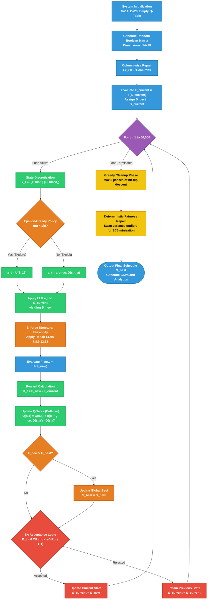

# Q-Learning Hyperheuristic (QLH) for Nurse Scheduling Problem
## Logical & Mathematical Framework

This document outlines the formal mathematical framework and the logical process flow of the Q-Learning Hyperheuristic applied to the Nurse Scheduling Problem (NSP).

### 1. Mathematical Formulation

#### 1.1 State Space ($S$)
The state $S_t \in S$ at iteration $t$ is a discretized representation of the schedule's current quality, defined by a tuple:

$$S_t = (F_{discrete}, P_{hard\_discrete})$$

Where:
- $F_{discrete} = \max(0, \lfloor \text{Fitness} / 1000 \rfloor)$
- $P_{hard\_discrete} = \min(10, \lfloor \text{HardPenalty} / 10000 \rfloor)$

#### 1.2 Action Space ($A$)
The action space consists of 15 Low-Level Heuristics (LLHs): $A = \{a_1, a_2, ..., a_{15}\}$. These are problem-specific mutation operators (e.g., Swap Shifts, Flip Bit, SlideBlock, Repair Constraints).

#### 1.3 Reward Function ($R$)
The reward $R_t$ received after applying an action $a_t$ that transitions the environment from state $S_t$ to $S_{t+1}$ is strictly defined by the change in the overall fitness function:

$$R_t = \text{Fitness}_{t+1} - \text{Fitness}_t$$

Where $\text{Fitness} = -(\text{Total Hard Penalties} + \text{Total Soft Penalties})$.

#### 1.4 Q-Value Update Rule (Bellman Equation)
The agent maintains a Q-Table $Q(S, a)$ tracking the expected utility of applying action $a$ in state $S$. It is updated as:

$$Q(S_t, a_t) \leftarrow Q(S_t, a_t) + \alpha \left[ R_t + \gamma \max_{a} Q(S_{t+1}, a) - Q(S_t, a_t) \right]$$

- **Learning Rate ($\alpha$)**: $0.2$. Controls how much new information overrides old information.
- **Discount Factor ($\gamma$)**: $0.9$. Determines the importance of future rewards.

#### 1.5 Action Selection (Epsilon-Greedy Policy)
With probability $\epsilon_t$, the algorithm selects a random action (Exploration). With probability $1 - \epsilon_t$, it selects the action with the maximum Q-value for the given state (Exploitation):

$$
a_t = \begin{cases} \text{random}(A) & \text{if } U(0,1) < \epsilon_t \\\\ \arg\max_a Q(S_t, a) & \text{otherwise} \end{cases}
$$

The exploration rate decays linearly over time:

$$\epsilon_t = \max\left(0.01, \epsilon_{init} \times \left(1 - \frac{t}{T_{max}}\right)\right)$$

### 2. Simulated Annealing (SA) Acceptance Criteria
To escape local optima, the algorithm sometimes accepts solutions that strictly decrease the fitness score, governed by Simulated Annealing mathematics.

#### 2.1 Temperature Decay Schedule
The temperature $T_t$ controls the probability of accepting worse solutions, decaying exponentially:

$$T_t = \max(0.01, 100 \times 0.9995^t)$$

#### 2.2 Acceptance Probability
If $\Delta \text{Fitness} = R_t > 0$, the new schedule is accepted unconditionally ($P_{accept} = 1$). 
If $R_t \leq 0$, it is accepted with probability:

$$P_{accept} = \exp\left(\frac{R_t}{T_t}\right)$$

---

### 3. Comprehensive Algorithmic Pseudocode

```text
ALGORITHM: QLH_NSP_Solver
INPUT: N (Nurses)=14, D (Days)=28, Target_Daily=6, Max_Iter=50000
OUTPUT: Optimized Schedule S_best

1. INITIALIZATION:
    Generate profiles for N nurses (preferences, history).
    Initialize Q-Table Q(s,a) = 0 for all s in S, a in A.
    S_current ← Generate_Random_Schedule(N, D)
    For d = 1 to D:
        Force exactly Target_Daily nurses to work on day d.
    Eval_current ← Evaluate_Fitness(S_current)
    S_best ← S_current, Eval_best ← Eval_current

2. MAIN OPTIMIZATION LOOP:
    For t = 1 to Max_Iter:
        // Decay Epsilon
        ε(t) ← max(0.01, 0.3 * (1 - t / Max_Iter))
        
        // Define State
        State_t ← Discretize(Eval_current.Fitness, Eval_current.HardPenalty)
        
        // Action Selection (Epsilon-Greedy)
        If Random(0,1) < ε(t):
            Action_t ← Random(0, 14)
        Else:
            Action_t ← argmax_a Q(State_t, a)
            
        // Apply Action & Sequential Feasibility Enforcement
        S_new ← Apply_LLH(S_current, Action_t)
        S_new ← Enforce_Feasibility(S_new) // Repairs constraints sequentially
        
        // Evaluate Outcome
        Eval_new ← Evaluate_Fitness(S_new)
        Reward_t ← Eval_new.Fitness - Eval_current.Fitness
        
        // Q-Learning Update
        State_next ← Discretize(Eval_new.Fitness, Eval_new.HardPenalty)
        Max_Q_next ← max_a Q(State_next, a)
        Q(State_t, Action_t) ← Q(State_t, Action_t) + 0.2 * (Reward_t + 0.9 * Max_Q_next - Q(State_t, Action_t))
        
        // Update Global Best
        If Eval_new.Fitness > Eval_best.Fitness:
            S_best ← S_new
            Eval_best ← Eval_new
            
        // Solution Acceptance (Simulated Annealing)
        If Reward_t > 0:
            S_current ← S_new
            Eval_current ← Eval_new
        Else:
            Temp_t ← max(0.01, 100 * (0.9995 ^ t))
            P_accept ← exp(Reward_t / Temp_t)
            If Random(0,1) < P_accept:
                S_current ← S_new
                Eval_current ← Eval_new

3. POST-OPTIMIZATION: GREEDY CLEANUP
    For Pass = 1 to 5:
        Improved ← False
        For Nurse = 1 to N:
            For Day = 1 to D:
                Flip S_best[Nurse][Day] state (0 <-> 1)
                Eval_temp ← Evaluate_Fitness(S_best)
                If Eval_temp is Feasible AND Eval_temp.SoftPenalty < Eval_best.SoftPenalty:
                    Eval_best ← Eval_temp
                    Improved ← True
                Else:
                    Revert Flip S_best[Nurse][Day] 
        If not Improved: Break

4. POST-OPTIMIZATION: DETERMINISTIC FAIRNESS REPAIR (SC5 TARGETING)
    For Target_Days in [Mondays, Fridays]:
        Repeat until no improvements:
            Calculate Off-Days for each nurse on Target_Days
            Sort nurses ascending by Off-Days (Victims first, Beneficiaries last)
            Find pair (Victim, Beneficiary) where Victim_Offs < 2 AND Beneficiary_Offs > 2
            If found:
                Find day D in Target_Days where Victim works AND Beneficiary is Off
                Swap shifts: Victim ← Off, Beneficiary ← Work
                If New_SoftPenalty <= Best_SoftPenalty + 1 (Buffer allowed):
                    Keep Swap
                Else:
                    Revert Swap

5. RETURN S_best
```

---

### 4. Logical System Flowchart

The flowchart defines paths, transition criteria, and state modifications throughout the lifespan of the scheduling system.


